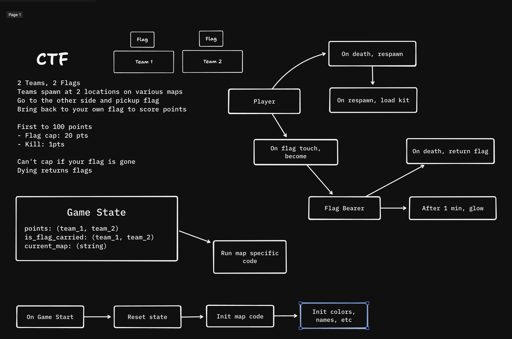

# Shulker Rewrite

## Current
- [x] Fix up the codebase so that we can deploy
- [x] Nested resources for maps
- [/] MVP for duels

## MVP for Duels
Create a working duels map with atleast 2 kits.

- [x] Duel map model + state modeling
- [x] Map state handling
- [x] Joining duels
- [x] Start/stop duel games
  - [x] Start
  - [x] Pre-game
  - [x] End
- [x] Player death/respawn handling
- [x] Kill handling
  - [x] Tracking kills
  - [x] End game detection
  - [/] Ties
- [x] Basic lobby
- [/] Spectator
- [x] Closing instance
- [ ] Post game timer
- [x] Forfeits

## Objective 2

Create a MVP of CTF with atleast footman.

## Tasks
- basic CTF game mode
- active game manager (start, stop, loop)
  - joining game via lobby box
  - leaving game

### Events
- `leave_game`
- `join_game`
- `start_game`
- `stop_game`
- `player_death`
- `player_respawn`
- `player_kill`

### CTF

### State
- Team[]
    - Points
    - Flag Bearer
    - Winner
    - Players[]
      - `carrying_flag`
      - `stats`
- Map
  - `stats`

### Transitions
- event: `start_game(map)`

- event: `end_game(map)`

- event: `close_game(map)`

- event: `on_kill(killer, victim)`
  - `killer.team.points += 1`
  - `victim.carrying_flag = false`
  - `victim.respawn`

- event: `on_flag_pickup(player, victim_team)`
  - `player.carrying_flag = true`

- event: `on_flag_cap(player)`
  - `player.team.points += 20`
  - `player.carrying_flag = false`

- event: `leave_game(player)`

- event: `join_game(player)`
